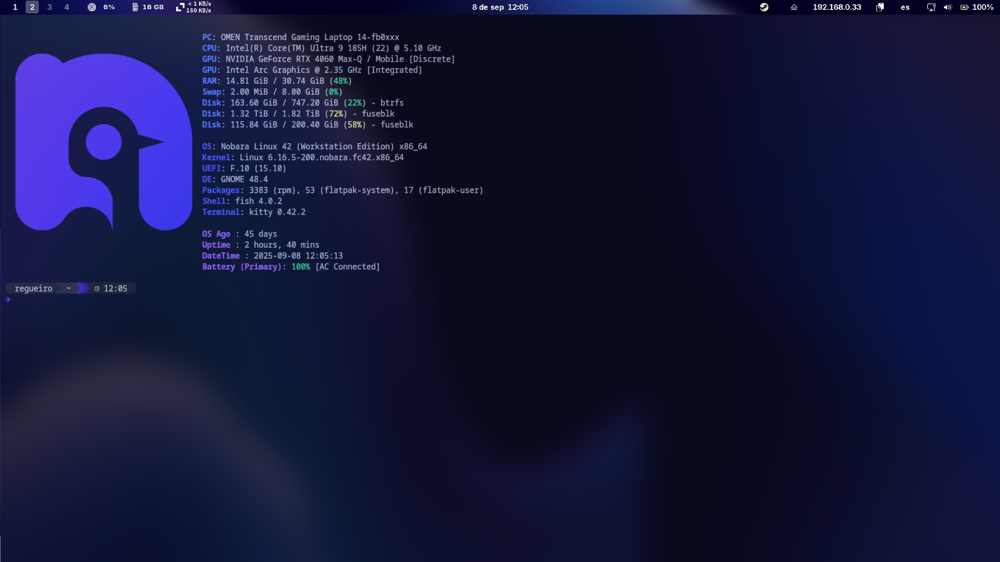
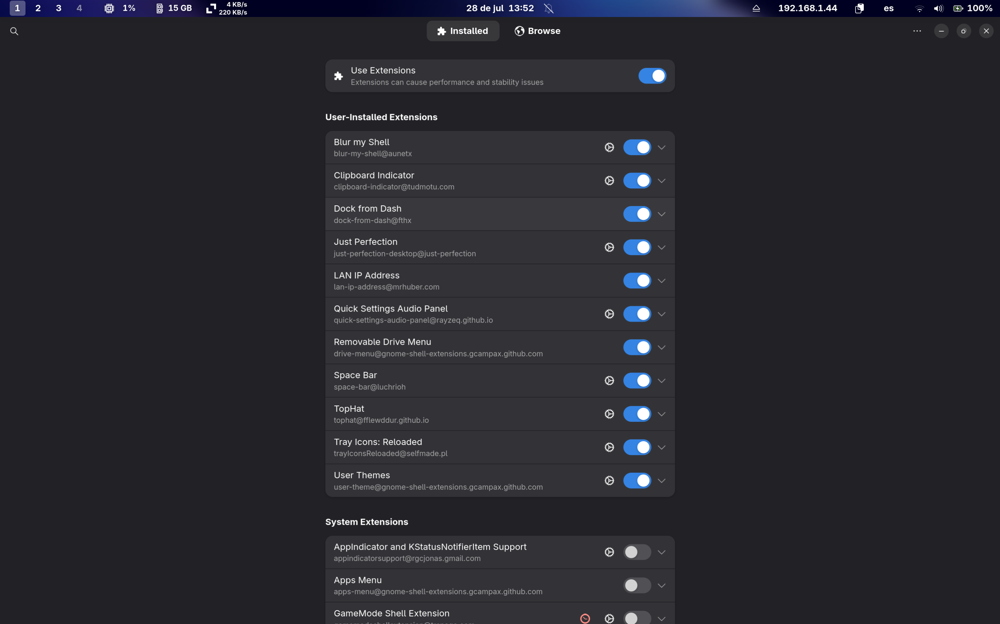

# MyNobaraDotFiles

Custom dotfiles and system tweaks tailored for **Nobara Linux** (Fedora-based).
This setup enhances your **GNOME desktop**, improves **terminal experience**, and optimizes your system for **gaming, remote access, and language learning**.

---

## 📦 Included Configurations

* Kitty terminal setup
* Starship prompt theme
* MangoHud performance overlay
* GNOME visual and behavior tweaks
* Auto-mounting NTFS external game drive
* SSH alias setup
* MPV immersion playback config

---

## 🖥 Terminal & CLI Tools

### 🔹 Kitty Terminal

* Config: `~/.config/kitty/kitty.conf`
* Clean, minimal, and readable layout optimized for daily use

### 🔹 Starship Prompt

* Config: `~/.config/starship.toml`
* Features:

  * Git status
  * Conda environments
  * Execution time
  * Battery indicator (on supported setups)

---

## 📊 Performance Monitoring

### 🔸 MangoHud (for gaming overlays)

* Enable per-game:

  ```bash
  MANGOHUD=1 gamemoderun %command%
  ```
* GPU selection (via GOverlay):

  * Go to **Visual Settings**
  * Set correct PCI GPU (e.g. `1:00.0` for NVIDIA)

---

## 🖼 GNOME Desktop Tweaks

### 🎛 Behavior Fixes

**Restore traditional Alt+Tab (individual windows, not grouped by app):**

```bash
gsettings set org.gnome.desktop.wm.keybindings switch-windows "['<Alt>Tab']"
gsettings set org.gnome.desktop.wm.keybindings switch-windows-backward "['<Shift><Alt>Tab']"
gsettings set org.gnome.desktop.wm.keybindings switch-applications "[]"
gsettings set org.gnome.desktop.wm.keybindings switch-applications-backward "[]"
```

**Show battery percentage in top bar:**

```bash
gsettings set org.gnome.desktop.interface show-battery-percentage true
```

---

### 🎨 Visual Style

#### 🔸 Themes Used

| Component  | Theme                 | Source Link                                                               |
| ---------- | --------------------- | ------------------------------------------------------------------------- |
| GTK Theme  | WhiteSur-Dark         | [WhiteSur-gtk-theme](https://github.com/vinceliuice/WhiteSur-gtk-theme)   |
| Icon Theme | MacTahoe              | [MacTahoe-icon-theme](https://github.com/vinceliuice/MacTahoe-icon-theme) |
| Cursor     | Bibata Modern Classic | [Bibata Cursor](https://github.com/ful1e5/Bibata_Cursor)                  |

> Install these manually or using their provided install scripts.

---

## 🎮 External Game Drive Setup (NTFS)

### Use Case: Mounting a 2TB M.2 external drive for Steam game storage

1. Find UUID of the drive:

   ```bash
   sudo blkid
   ```

2. Add this to `/etc/fstab` (replace `xxxx-...` with actual UUID):

   ```bash
   UUID=xxxxxxxx-xxxx-xxxx-xxxx-xxxxxxxxxxxx  /mnt/gamedrive  ntfs-3g  uid=1000,gid=1000,rw,exec,umask=000,nofail,x-gvfs-show  0  0
   ```
   Do this with caution and at your own risk.

3. Create mount point:

   ```bash
   sudo mkdir -p /mnt/gamedrive
   ```

> ⚠️ **Backup your `/etc/fstab`** before editing. Mistakes can prevent your system from booting.

---

## 🌐 Remote Access (SSH)

Set up an SSH alias for convenience. Add this to `~/.bashrc`:

```bash
alias sshserver='ssh username@hostname'
```

Apply changes:

```bash
source ~/.bashrc
```

---

## 🎥 MPV Language Immersion Config

For watching shows/movies with **dual subtitles** and advanced language-learning features:

1. Clone the config:

   ```bash
   git clone https://github.com/MiguelRegueiro/MPV-Language-Immersion-config.git
   ```

2. Install to the correct location:

   * Native: `~/.config/mpv/`
   * Flatpak: `~/.var/app/io.mpv.Mpv/config/mpv/`
   * Windows: `%APPDATA%\mpv\`

> Includes keybindings, dual subtitles, and pause-on-hover features.

---

## 🛠️ How to Use This Repo

1. Clone:

   ```bash
   git clone https://github.com/yourusername/MyNobaraDotFiles.git
   ```

2. Copy over desired configs to:

   * `~/.config/kitty/`
   * `~/.config/starship.toml`
   * etc.

3. Apply GNOME settings:

   ```bash
   # Alt+Tab tweak
   # Battery percentage
   ```

---

### 📸 GNOME Desktop Screenshots

#### 🖥️ Desktop with Terminal

A look at my customized GNOME desktop with `kitty` terminal open:



---

#### 🧩 Extension Manager Open

A preview of all installed GNOME extensions inside **Extension Manager**:



---


## ⚠️ Notes & Compatibility

* These configs were built and tested on **Nobara Linux**, but most will work on:

  * Fedora GNOME
  * Other systemd-based distros using GNOME
* Some parts (like `fstab`, MangoHud) require additional packages like:

  * `ntfs-3g`
  * `gamemode`
  * `mangohud`

---
