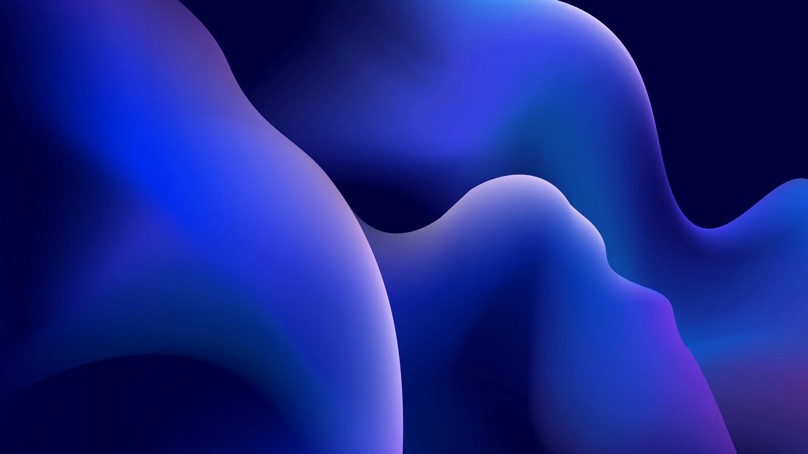

# 🚀 MyNobaraDotFiles

**Custom dotfiles and system tweaks tailored for *Nobara Linux*** (Fedora-based).
This setup enhances your **GNOME desktop**, improves your **terminal experience**, and optimizes your system for **gaming, remote access, and language learning**.

---

## 📦 Included Configurations

### 🎛️ Terminal

* 🐱 **Kitty** terminal setup
* ⭐ **Starship prompt** with custom Nobara/Fedora logos

### 🎮 Gaming

* 🛠️ MangoHud fixes for better in-game overlays
* 🔌 NTFS game drive auto-mount for seamless access

### 🖥️ GNOME

* 🔄 Tweaked **Alt+Tab** behavior & battery indicator in top bar
* 🎨 **WhiteSur theme** + **MacTahoe icons** + **Bibata cursor** for a sleek UI
* 🖼️ Included wallpaper: `media/wallpaper.jpg`
* 🧩 Essential GNOME extensions [View recommended extensions in Extension Manager →](#extension-manager-open)

### 🛠️ Tools

* 🔐 Handy SSH server alias for quick remote access
* 🎬 MPV player configuration for language immersion
* 🅰️ Fonts for Anki cards (Chinese and japanese fonts)

---

### 📸 GNOME Desktop Screenshot

#### 🖥️ Desktop with Terminal

A look at my customized GNOME desktop with `kitty` terminal open:


---


## 🖥 Terminal & CLI Tools

### 🔹 Kitty Terminal

* Config: `~/.config/kitty/kitty.conf`
* Clean, minimal, and readable layout optimized for daily use

### 🔹 Starship Prompt

* Config: `~/.config/starship.toml`
* Features:

  * Git status
  * Conda environments
  * Execution time
  * Battery indicator (on supported setups)

---

## 📊 Performance Monitoring
### 🔸 MangoHud (for gaming overlays)

* Enable:
  ```bash
  MANGOHUD=1
  ```

* Enable per-game:

  ```bash
  MANGOHUD=1 gamemoderun %command%
  ```
* GPU selection (via GOverlay):

  * Go to **Visual Settings**
  * Set correct PCI GPU (e.g. `1:00.0` for NVIDIA)

---

## 🖼 GNOME Desktop Tweaks

### 🎛 Behavior Fixes

**Restore traditional Alt+Tab (individual windows, not grouped by app):**

```bash
gsettings set org.gnome.desktop.wm.keybindings switch-windows "['<Alt>Tab']"
gsettings set org.gnome.desktop.wm.keybindings switch-windows-backward "['<Shift><Alt>Tab']"
gsettings set org.gnome.desktop.wm.keybindings switch-applications "[]"
gsettings set org.gnome.desktop.wm.keybindings switch-applications-backward "[]"
```

**Show battery percentage in top bar:**

```bash
gsettings set org.gnome.desktop.interface show-battery-percentage true
```

---

### 🎨 Visual Style

#### 🛠️ Prerequisites
1. Install required tools:
   ```bash
   sudo dnf install gnome-tweaks
   ```
2. Enable **User Themes** extension:
   - Open Extensions app (`gnome-extensions-app`)
   - Search for "User Themes"
   - Enable the extension

#### 🔸 Themes Used

| Component  | Theme                 | Source Link                                                               |
| ---------- | --------------------- | ------------------------------------------------------------------------- |
| GTK Theme  | WhiteSur-Dark         | [WhiteSur-gtk-theme](https://github.com/vinceliuice/WhiteSur-gtk-theme)   |
| Icon Theme | MacTahoe              | [MacTahoe-icon-theme](https://github.com/vinceliuice/MacTahoe-icon-theme) |
| Cursor     | Bibata Modern Classic | [Bibata Cursor](https://github.com/ful1e5/Bibata_Cursor)                  |

> Install these manually or using their provided install scripts.

  
1. Open **GNOME Tweaks**
2. Navigate to "Appearance" tab
3. Set:

   | Setting       | Value                  |
   |---------------|------------------------|
   | Cursor        | Bibata-Modern-Classic  |
   | Icons         | MacTahoe-dark          |
   | Shell         | WhiteSur-Dark          |
   | Legacy Applications  | WhiteSur-Dark   |


### 🖼️ Included Wallpaper
  
Located in `media/wallpaper.jpg` - set as your desktop background for the complete look.
**To set wallpaper:**
1. Right-click desktop → "Change Background"
2. Select "Wallpapers" tab
3. Click "+" to add `media/wallpaper.jpg`
4. Select your new wallpaper


---

## 🎮 External Game Drive Setup (NTFS)

### Use Case: Mounting a 2TB M.2 external drive for Steam game storage

1. Find UUID of the drive:

   ```bash
   sudo blkid
   ```

2. Add this to `/etc/fstab` (replace `xxxx-...` with actual UUID):

   ```bash
   UUID=xxxxxxxx-xxxx-xxxx-xxxx-xxxxxxxxxxxx  /mnt/gamedrive  ntfs-3g  uid=1000,gid=1000,rw,exec,umask=000,nofail,x-gvfs-show  0  0
   ```

3. Create mount point:

   ```bash
   sudo mkdir -p /mnt/gamedrive
   ```

> ⚠️ **Backup your `/etc/fstab`** before editing. Mistakes can prevent your system from booting.
>  Do this with caution and at your own risk.

---

## 🌐 Remote Access (SSH) to your server using tailscale or  similar
Onece ur computer and server are connected to ur vpn:

Set up an SSH alias for convenience. Add this to `~/.bashrc`:

```bash
alias sshserver='ssh username@hostname'
```

Apply changes:

```bash
source ~/.bashrc
```

---

## 🎥 MPV Language Immersion Configuration

**Enhanced media playback for language learning** with automatic playback, and language-specific presets.

### 📌 Installation Paths
| Installation Type | Config Location                          |
|-------------------|-----------------------------------------|
| Native Linux      | `~/.config/mpv/`                        |
| Flatpak           | `~/.var/app/io.mpv.Mpv/config/mpv/`     |
| Windows           | `%APPDATA%\mpv\`                        |


### **1️⃣ Install Native MPV (Recommended)**
```bash
# Install MPV with full codec support
sudo dnf install mpv ffmpeg

# For hardware acceleration (Intel/NVIDIA/AMD):
sudo dnf install libva-intel-driver libva-utils mesa-vdpau-drivers
```


### **2️⃣ Configuration File Locations**
#### **Native Installation Paths**:
```
~/.config/mpv/
├── mpv.conf           # Main config
├── input.conf        # Keybindings
└── scripts/          # Custom Lua scripts
```

### **3️⃣ Install Language Immersion Config**
```bash
# Create config directory
mkdir -p ~/.config/mpv
```


### 🌍 Language Support
Pre-configured for optimal experience with:
- 日本語 (Japanese)
- 简体中文 (Chinese Simplified)
- Português (Portuguese)
- Русский (Russian)
- English
- Español (Spanish)

### ✨ Key Features
- **Autoplay functionality** for immersion sessions
- **Language-specific presets**:
  - Preferred audio tracks
  - Subtitle styling
- **Smart pause/resume** behavior

> Note: This is a personalized configuration that may need adjustment for your specific language learning needs.


Would you like me to make any additional adjustments to this section?

## 🛠️ How to Use This Repo

1. Clone:

   ```bash
   git clone https://github.com/MiguelRegueiro/MyNobaraDotFiles
   ```

2. Copy over desired configs to:

   * `~/.config/kitty/`
   * `~/.config/starship.toml`
   * etc.

3. Apply GNOME settings:
   ```bash
   # See GNOME Desktop Tweaks section for commands →
   ```
   [→ Jump to GNOME Tweaks](#-gnome-desktop-tweaks)

---


#### Extension Manager Open

A preview of all installed GNOME extensions inside **Extension Manager**:


---


## ⚠️ Notes & Compatibility

* These configs were built and tested on **Nobara Linux**, but most will work on:

  * Fedora GNOME
  * Other systemd-based distros using GNOME
* Some parts (like `fstab`, MangoHud) require additional packages like:

  * `ntfs-3g`
  * `gamemode`
  * `mangohud`

---
