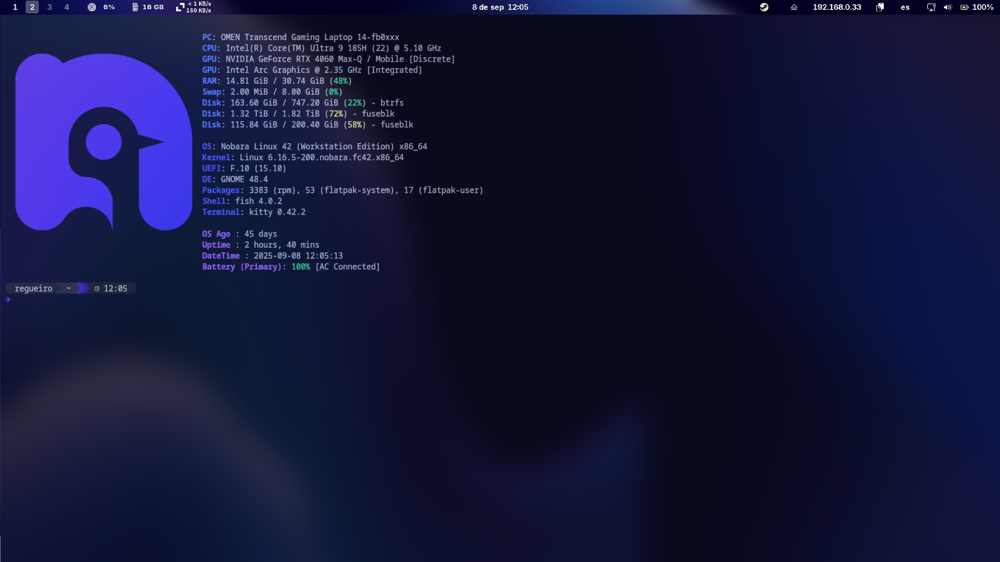
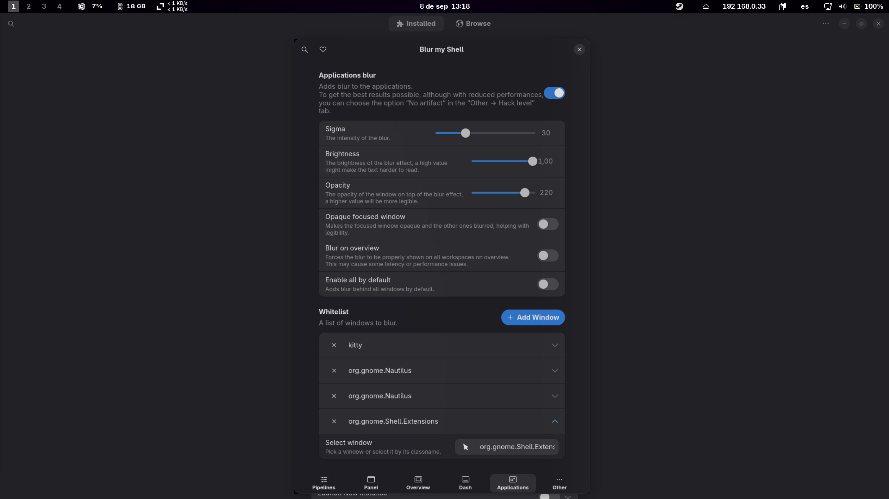

# 🚀 MyNobaraDotFiles

**Custom dotfiles and system tweaks for Nobara Linux** (Fedora-based).

This setup **made using for Nobara**, but it also works on **other Fedora-based distributions**. Some tools and configurations are universal. I even use most of these tools on a separate Fedora system that isn’t meant for gaming, so this guide can serve as a reference for **any Fedora-based setup**.

With this setup, you can:

* ✨ Enhance your **GNOME desktop**
* 💻 Improve your **terminal experience**
* 🎮 Optimize your system for **gaming**
* 🌐 Set up **remote access**
* 📝 Support **language learning**
* 🎇 **Many** other goodies

💡 **Tip:** You’re free to pick and choose the tools, configs, and themes you like. This is my personal setup guide—tweak anything, swap things out, or follow it exactly as I do. **Make it your own!**

---

<details>
<summary><h2>📦 Summary of the Included Configurations</h2></summary>

### 🎛️ Terminal

* 🐱 **Kitty** terminal setup
* ⭐ **Starship prompt** with custom Nobara/Fedora logos
* 🐟 **Fish Shell** with useful abbreviations for common comands 

### 🎮 Gaming

* 🛠️ **MangoHud** fixes for better in-game overlays
* 🔌 **NTFS** game **drive auto-mount** for seamless access and steam compatibility
* 🔧 **Btop** for a light weight system monitor

### 🖥️ GNOME

* 🔄 Tweaked **Alt+Tab** behavior & battery indicator in top bar
* ⌨️ Custom Keyboard Shortcuts
* 🎨 **WhiteSur theme** + **MacTahoe icons** + **Bibata cursor** for a sleek UI
* 🖼️ Included **wallpaper**: `media/wallpaper.jpg`
* 🧩 Essential **GNOME extensions** [View recommended extensions in Extension Manager →](#extension-manager-open)

### 🛠️ Tools

* 🎬 **MPV** player **configuration** for language immersion
* 🅰️ **Fonts** for **Anki** cards (Chinese and japanese fonts)
* 📋 **Ocr** support with shortcut
* 📂 **Yazi** for llighting fast file search and file browser

</details>


---

<details>
<summary><h2>⬛ Terminal & CLI Tools</h2></summary>

✨ This setup combines **Kitty**, **Fish**, and **Starship** to create a **fast, modern, and highly customizable terminal experience**:

- **Kitty** → Clean, GPU-accelerated terminal with smooth performance  
- **Fish** → Intuitive shell with autosuggestions & syntax highlighting for effortless commands  
- **Starship** → Sleek, informative prompt with Git status, environments, execution time, and more  

🚀 The result is a **minimal yet powerful workflow** optimized for **productivity, readability, and daily use**.
<br></br>


### 🔹 Kitty Terminal

* Config: `~/.config/kitty/kitty.conf`


### 🔹 Fish Shell

* Install:  
  ```bash
  sudo dnf install fish

* Set as default shell:
  ```bash
  chsh -s /usr/bin/fish

 * Config: ~/.config/fish/config.fish


### 🔹 Starship Prompt


* Install:  
  ```bash
  curl -sS https://starship.rs/install.sh | sh
* Config: `~/.config/starship.toml`

#### 🖥️ Desktop with Terminal

A look at my customized GNOME desktop with `kitty` terminal open:



</details>


---

<details>
<summary><h2>📊 Performance Monitoring</h2></summary>

### 🔸 MangoHud (for gaming overlays)

* Enable:
  ```bash
  MANGOHUD=1
  ```

* Enable per-game:

  ```bash
  MANGOHUD=1 gamemoderun %command%
  ```
* GPU selection (via GOverlay):

  * Go to **Visual Settings**
  * Set correct PCI GPU (e.g. `1:00.0` for NVIDIA)

### 🔸 Btop (system resources monitor) 
* Install:  
  ```bash
  sudo dnf install btop

</details>

---

<details>
<summary><h2>💻 GNOME Desktop Tweaks</h2></summary>

### ♣️ Behavior Fixes

**Restore traditional Alt+Tab (individual windows, not grouped by app):**

```bash
gsettings set org.gnome.desktop.wm.keybindings switch-windows "['<Alt>Tab']"
gsettings set org.gnome.desktop.wm.keybindings switch-windows-backward "['<Shift><Alt>Tab']"
gsettings set org.gnome.desktop.wm.keybindings switch-applications "[]"
gsettings set org.gnome.desktop.wm.keybindings switch-applications-backward "[]"
```

**Show battery percentage in top bar:**

```bash
gsettings set org.gnome.desktop.interface show-battery-percentage true
```

### ⌨️ Custom Keyboard Shortcuts

#### 🚀 Application Launchers

| Shortcut       | Application          | Command                          |
|----------------|----------------------|----------------------------------|
| `Super + E`    | Files (Nautilus)     | `nautilus --new-window`          |
| `Super + Enter`| Kitty Terminal       | `kitty`                          |
| `Super + D`    | Yazi File Manager    | `kitty -e yazi`                  |
| `Super + R`    | Btop                 | `kitty -e btop`                  |
| `Super + B`    | Zen Browser          | `flatpak run app.zen_browser.zen`|
| `Super + F9`| Ocr      | `/usr/bin/flatpak run com.github.dynobo.normcap`|

### 🔧 How to Set These Shortcuts

1. Open **Settings** → **Keyboard** → **Keyboard Shortcuts**
2. Scroll down and click **"View and Customize Shortcuts"**
3. Select **"Custom Shortcuts"** in the sidebar
4. Click the **+** button to add each shortcut

### 🎨 Visual Style

#### 🛠️ Prerequisites
1. Install required tools:
   ```bash
   sudo dnf install gnome-tweaks
   ```
2. Enable **User Themes** extension:
   - Open Extensions app (`gnome-extensions-app`)
   - Search for "User Themes"
   - Enable the extension

#### 🔸 Themes Used

| Component  | Theme                 | Source Link                                                               |
| ---------- | --------------------- | ------------------------------------------------------------------------- |
| GTK Theme  | WhiteSur-Dark         | [WhiteSur-gtk-theme](https://github.com/vinceliuice/WhiteSur-gtk-theme)   |
| Icon Theme | MacTahoe              | [MacTahoe-icon-theme](https://github.com/vinceliuice/MacTahoe-icon-theme) |
| Cursor     | Bibata Modern Classic | [Bibata Cursor](https://github.com/ful1e5/Bibata_Cursor)                  |

> Install these manually or using their provided install scripts.

  
1. Open **GNOME Tweaks**
2. Navigate to "Appearance" tab
3. Set:

   | Setting       | Value                  |
   |---------------|------------------------|
   | Cursor        | Bibata-Modern-Classic  |
   | Icons         | MacTahoe-dark          |
   | Shell         | WhiteSur-Dark          |
   | Legacy Applications  | WhiteSur-Dark   |

### 🖼️ Included Wallpaper
  
Located in `media/wallpaper.jpg` - set as your desktop background for the complete look.
**To set wallpaper:**
1. Right-click desktop → "Change Background"
2. Select "Wallpapers" tab
3. Click "+" to add `media/wallpaper.jpg`
4. Select your new wallpaper

</details>

---

<details>
<summary><h2>🎮 External Game Drive Setup (NTFS)</h2></summary>

### Use Case: Mounting a 2TB M.2 external drive for Steam game storage

1. Find UUID of the drive:

   ```bash
   sudo blkid
   ```

2. Add this to `/etc/fstab` (replace `xxxx-...` with actual UUID):

   ```bash
   UUID=xxxxxxxx-xxxx-xxxx-xxxx-xxxxxxxxxxxx  /mnt/gamedrive  ntfs-3g  uid=1000,gid=1000,rw,exec,umask=000,nofail,x-gvfs-show  0  0
   ```

3. Create mount point:

   ```bash
   sudo mkdir -p /mnt/gamedrive
   ```

> ⚠️ **Backup your `/etc/fstab`** before editing. Mistakes can prevent your system from booting.
>  Do this with caution and at your own risk.

</details>

---

<details>
<summary><h2>🌐 Remote Access (SSH) to your server using tailscale or similar</h2></summary>

Once your computer and server are connected to your VPN:

Set up an SSH alias for convenience. Add this to `~/.bashrc`:

```bash
alias sshserver='ssh username@hostname'
```

Apply changes:

```bash
source ~/.bashrc
```

</details>

---

<details>
<summary><h2>🎥 MPV Language Immersion Configuration</h2></summary>

**Enhanced media playback for language learning** with automatic playback, and language-specific presets.

### 📌 Installation Paths
| Installation Type | Config Location                          |
|-------------------|-----------------------------------------|
| Native Linux      | `~/.config/mpv/`                        |
| Flatpak           | `~/.var/app/io.mpv.Mpv/config/mpv/`     |
| Windows           | `%APPDATA%\mpv\`                        |

### **1️⃣ Install Native MPV (Recommended)**
```bash
# Install MPV with full codec support
sudo dnf install mpv ffmpeg

# For hardware acceleration (Intel/NVIDIA/AMD):
sudo dnf install libva-intel-driver libva-utils mesa-vdpau-drivers
```

### **2️⃣ Configuration File Locations**
#### **Native Installation Paths**:
```
~/.config/mpv/
├── mpv.conf           # Main config
├── input.conf        # Keybindings
└── scripts/          # Custom Lua scripts
```

### **3️⃣ Install Language Immersion Config**
```bash
# Create config directory
mkdir -p ~/.config/mpv
```

### 🌍 Language Support
Pre-configured for optimal experience with:
- 日本語 (Japanese)
- 简体中文 (Chinese Simplified)
- Português (Portuguese)
- Русский (Russian)
- English
- Español (Spanish)

### ✨ Key Features
- **Autoplay functionality** for immersion sessions
- **Language-specific presets**:
  - Preferred audio tracks
  - Subtitle styling
- **Smart pause/resume** behavior

> Note: This is a personalized configuration that may need adjustment for your specific language learning needs.

</details>


---

<details> <summary><h2>📋 OCR Tool (NormCap)</h2></summary>
✨ Optical Character Recognition for Easy Text Capture

NormCap is a cross-platform OCR tool that lets you quickly capture text from anywhere on your screen.
🔹 Installation
bash

# Install via Flatpak (recommended)
flatpak install flathub com.github.dynobo.normcap

🔹 Usage

    Launch NormCap using the keyboard shortcut: Super + F9

    Select an area on your screen containing text

    Text is automatically copied to your clipboard

    Paste anywhere you need the text

🔹 Features

    ✅ Captures text from images, videos, PDFs, etc.

    ✅ Supports multiple languages

    ✅ Automatically copies to clipboard

    ✅ Lightweight and fast

    ✅ Cross-platform (Linux, Windows, macOS)

> 💡  **Important**  
> Go to 💻 GNOME Desktop Tweaks and then ⌨️ Custom Keyboard Shortcuts to add a shortcut for the OCR
</details>

---


<details> <summary><h2>📂 Yazi</h2></summary>
✨ Minimal and Highly Customizable Text Editor

Yazi is a lightweight text editor designed for fast editing and simplicity. You can fully customize it using your own config files.

🔹 Installation

```bash
# Install via DNF
sudo dnf install yazi
```

🔹 Configuration

My configuration files are included in this repository under the folder: `yazi`.
You can copy them to your Yazi config directory to use my setup:

```bash
cp -r yazi/* ~/.config/yazi/
```

🔹 Usage

```bash
# Launch Yazi from terminal
yazi
```

🔹 Features

✅ Lightweight and minimal
✅ Fully configurable via dotfiles
✅ Syntax highlighting for multiple languages
✅ Fast startup and low resource usage
✅ Ideal for both coding and note-taking

> 💡 **Tip**
> Customize your keybindings, themes, and plugins in your config files for the best experience.


<details> <summary><h2>⚙️ Set Neovim as Default Editor for Yazi</h2></summary>
By default, Yazi may open files using Nano. To make it use **Neovim (`nvim`)**, set your environment variables.

**For Fish shell users:**

```fish
# Remove any existing global EDITOR variable
set -e EDITOR

# Set Neovim as the default editor
set -Ux EDITOR nvim
set -Ux VISUAL nvim
```

✅ Verify:

```fish
echo $EDITOR
echo $VISUAL
```

Both should output: `nvim`

Now Yazi will open files using Neovim by default.
</details>

</details>

---


<details>
<summary><h2>🛠️ How to Use This Repo</h2></summary>

1. Clone:

   ```bash
   git clone https://github.com/MiguelRegueiro/MyNobaraDotFiles
   ```

2. Copy over desired configs to:

   * `~/.config/kitty/`
   * `~/.config/starship.toml`
   * etc.

3. Apply GNOME settings:

> 💡  **Important**  
> Go to 💻 GNOME Desktop Tweaks for this step

4. Installed the desired tools

</details>

---

<details>
<summary><h2>📸 Extension Manager View</h2></summary>

#### Extension Manager Open

A preview of all installed GNOME extensions inside **Extension Manager**:


**Blur My shell config** for blured apps in gnome:



</details>

---

<details>
<summary><h2>⚠️ Notes & Compatibility</h2></summary>

* These configs were built and tested on **Nobara Linux**, but most will work on:

  * Fedora GNOME
  * Other systemd-based distros using GNOME
* Some parts (like `fstab`, MangoHud) require additional packages like:

  * `ntfs-3g`
  * `gamemode`
  * `mangohud`

</details>


---
